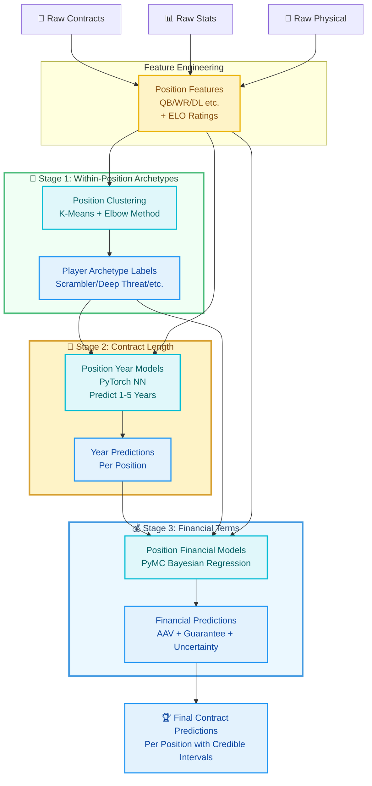

# NFL-Market-Value-Analysis

```mermaid
graph TB
    %% === STYLING ===
    classDef stage1 fill:#f0fff4,stroke:#48bb78,stroke-width:3px,color:#22543d
    classDef stage2 fill:#fef3c7,stroke:#d69e2e,stroke-width:3px,color:#744210
    classDef stage3 fill:#ebf8ff,stroke:#4299e1,stroke-width:3px,color:#2a4365
    classDef features fill:#fef3c7,stroke:#eab308,stroke-width:2px,color:#854d0e
    classDef model fill:#e0f7fa,stroke:#00bcd4,stroke-width:2px,color:#006064
    classDef output fill:#e3f2fd,stroke:#2196f3,stroke-width:2px,color:#0d47a1

    %% === DATA SOURCES ===
    RAW_CONTRACTS["📄 Raw Contracts"]
    RAW_STATS["📊 Raw Stats"]
    RAW_PHYSICAL["📏 Raw Physical"]

    %% === FEATURE ENGINEERING ===
    subgraph FEATURE_ENG ["Feature Engineering"]
        POSITION_FEATURES["Position Features<br/>QB/WR/DL etc.<br/>+ ELO Ratings"]
    end

    %% === STAGE 1: ARCHETYPE DISCOVERY ===
    subgraph STAGE_1 ["🎯 Stage 1: Within-Position Archetypes"]
        POSITION_CLUSTERING["Position Clustering<br/>K-Means + Elbow Method"]
        PLAYER_ARCHETYPES["Player Archetype Labels<br/>Scrambler/Deep Threat/etc."]
    end

    %% === STAGE 2: YEAR PREDICTION ===
    subgraph STAGE_2 ["🔮 Stage 2: Contract Length"]
        POSITION_YEAR_MODELS["Position Year Models<br/>PyTorch NN<br/>Predict 1-5 Years"]
        YEAR_PREDICTIONS["Year Predictions<br/>Per Position"]
    end

    %% === STAGE 3: FINANCIAL PREDICTION ===
    subgraph STAGE_3 ["💰 Stage 3: Financial Terms"]
        POSITION_FINANCIAL_MODELS["Position Financial Models<br/>PyMC Bayesian Regression"]
        FINANCIAL_PREDICTIONS["Financial Predictions<br/>AAV + Guarantee + Uncertainty"]
    end

    %% === FINAL OUTPUT ===
    FINAL_PREDICTIONS["🏆 Final Contract Predictions<br/>Per Position with Credible Intervals"]

    %% === DATA FLOW ===
    RAW_CONTRACTS --> POSITION_FEATURES
    RAW_STATS --> POSITION_FEATURES
    RAW_PHYSICAL --> POSITION_FEATURES
    
    POSITION_FEATURES --> POSITION_CLUSTERING
    POSITION_CLUSTERING --> PLAYER_ARCHETYPES
    
    PLAYER_ARCHETYPES --> POSITION_YEAR_MODELS
    POSITION_FEATURES --> POSITION_YEAR_MODELS
    POSITION_YEAR_MODELS --> YEAR_PREDICTIONS
    
    YEAR_PREDICTIONS --> POSITION_FINANCIAL_MODELS
    PLAYER_ARCHETYPES --> POSITION_FINANCIAL_MODELS
    POSITION_FEATURES --> POSITION_FINANCIAL_MODELS
    POSITION_FINANCIAL_MODELS --> FINANCIAL_PREDICTIONS
    
    FINANCIAL_PREDICTIONS --> FINAL_PREDICTIONS

    %% === STYLES ===
    class STAGE_1 stage1
    class STAGE_2 stage2
    class STAGE_3 stage3
    class POSITION_FEATURES features
    class POSITION_CLUSTERING,POSITION_YEAR_MODELS,POSITION_FINANCIAL_MODELS model
    class PLAYER_ARCHETYPES,YEAR_PREDICTIONS,FINANCIAL_PREDICTIONS,FINAL_PREDICTIONS output;
```
