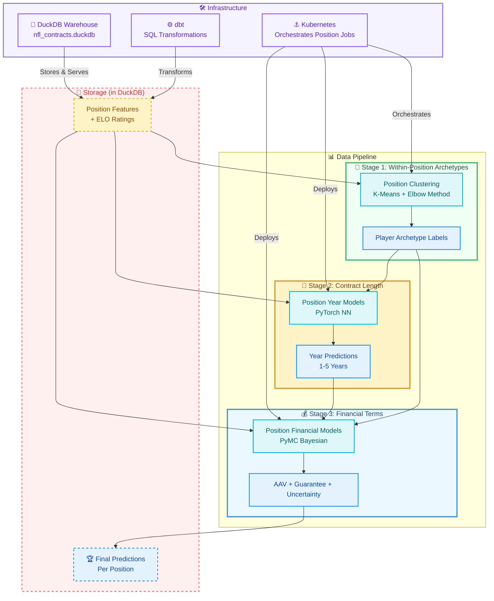

# NFL-Market-Value-Analysis

```mermaid
graph TB
 %% === STYLING ===
    classDef stage1 fill:#f0fff4,stroke:#48bb78,stroke-width:3px,color:#22543d
    classDef stage2 fill:#fef3c7,stroke:#d69e2e,stroke-width:3px,color:#744210
    classDef stage3 fill:#ebf8ff,stroke:#4299e1,stroke-width:3px,color:#2a4365
    classDef features fill:#fef3c7,stroke:#eab308,stroke-width:2px,color:#854d0e
    classDef model fill:#e0f7fa,stroke:#00bcd4,stroke-width:2px,color:#006064
    classDef output fill:#e3f2fd,stroke:#2196f3,stroke-width:2px,color:#0d47a1
    classDef infra fill:#f5f3ff,stroke:#8b5cf6,stroke-width:2px,color:#5b21b6
    classDef storage fill:#fff0f0,stroke:#FF6B6B,stroke-width:2px,stroke-dasharray:5 5,color:#c53030

    %% === INFRASTRUCTURE LAYERS ===
    subgraph INFRA ["🛠️ Infrastructure"]
        DUCKDB["🦆 DuckDB Warehouse<br/>nfl_contracts.duckdb"]
        K8S["⚓ Kubernetes<br/>Orchestrates Position Jobs"]
        DBT["⚙️ dbt<br/>SQL Transformations"]
    end

    %% === DATA FLOW ===
    subgraph DATA_FLOW ["📊 Data Pipeline"]
        %% === STAGE 1: ARCHETYPE DISCOVERY ===
        subgraph STAGE_1 ["🎯 Stage 1: Within-Position Archetypes"]
            CLUSTERING["Position Clustering<br/>K-Means + Elbow Method"]
            ARCHETYPES["Player Archetype Labels"]
        end

        %% === STAGE 2: YEAR PREDICTION ===
        subgraph STAGE_2 ["🔮 Stage 2: Contract Length"]
            YEAR_MODELS["Position Year Models<br/>PyTorch NN"]
            YEAR_PREDS["Year Predictions<br/>1-5 Years"]
        end

        %% === STAGE 3: FINANCIAL PREDICTION ===
        subgraph STAGE_3 ["💰 Stage 3: Financial Terms"]
            FINANCIAL_MODELS["Position Financial Models<br/>PyMC Bayesian"]
            FINANCIAL_PREDS["AAV + Guarantee + Uncertainty"]
        end
    end

    %% === STORAGE LAYER ===
    subgraph STORAGE ["💾 Storage (in DuckDB)"]
        FEATURES["Position Features<br/>+ ELO Ratings"]
        RESULTS["🏆 Final Predictions<br/>Per Position"]
    end

    %% === CONNECTIONS ===
    %% Infrastructure → Data Flow
    DUCKDB -->|"Stores & Serves"| FEATURES
    DBT -->|"Transforms"| FEATURES
    K8S -->|"Orchestrates"| CLUSTERING
    K8S -->|"Deploys"| YEAR_MODELS
    K8S -->|"Deploys"| FINANCIAL_MODELS

    %% Data Pipeline Flow
    FEATURES --> CLUSTERING
    CLUSTERING --> ARCHETYPES
    ARCHETYPES --> YEAR_MODELS
    FEATURES --> YEAR_MODELS
    YEAR_MODELS --> YEAR_PREDS
    YEAR_PREDS --> FINANCIAL_MODELS
    ARCHETYPES --> FINANCIAL_MODELS
    FEATURES --> FINANCIAL_MODELS
    FINANCIAL_MODELS --> FINANCIAL_PREDS
    FINANCIAL_PREDS --> RESULTS

    %% === STYLES ===
    class INFRA,DUCKDB,K8S,DBT infra
    class STORAGE,FEATURES,RESULTS storage
    class STAGE_1 stage1
    class STAGE_2 stage2
    class STAGE_3 stage3
    class FEATURES features
    class CLUSTERING,YEAR_MODELS,FINANCIAL_MODELS model
    class ARCHETYPES,YEAR_PREDS,FINANCIAL_PREDS,RESULTS output;
```
