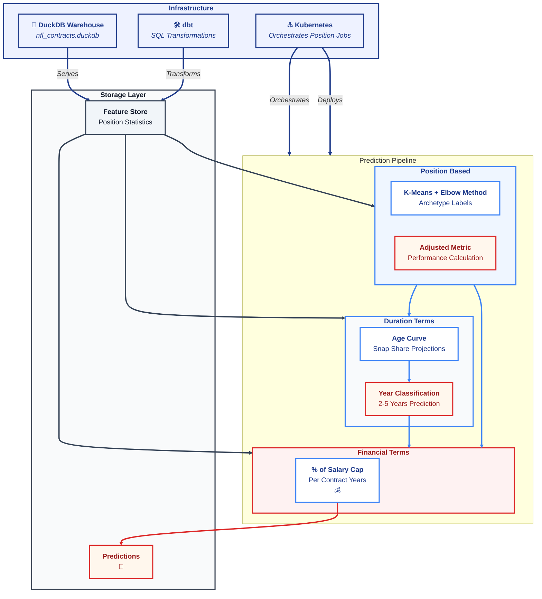

 
[GitHub](https://github.com/dec1costello) | [Kaggle](https://www.kaggle.com/dec1costello) | [LinkedIn](https://www.linkedin.com/in/declan-costello-7423aa137/)
 
Author: Declan Costello

  

<h1 align="center">NFL Player Contract Value Prediction</h1>

**Business Objective:** Predict NFL player contract terms (years, average annual value, guarantees, percent of team cap space) to identify market inefficiencies and optimize team salary cap management.

**Technical Approach:** A three stage ML pipeline using modern analytics engineering patterns. Features are engineered with SQL (dbt) and enriched with player archetypes via clustering. Contract length is predicted with PyTorch, and financial terms are estimated with PyMC Bayesian regression.

**Key Results:**
- ✅ **Position Specific Archetypes:** K-Means clustering within each position (QB, WR, RB, etc) to discover player subtypes
- ✅ **Probabilistic Financial Modeling:** Bayesian regression with credible intervals for risk aware decision making
- ✅ **Reproducible ML Pipeline:** Deterministic feature engineering and model training
- ✅ **Operational Analytics:** Predictions stored as DuckDB tables for team analytics consumption
- ✅ **Kubernetes Orchestration:** Scalable, position specific model deployment

**Architecture Rationale:** DuckDB was selected as the central warehouse for its embedded nature and SQL compliance, eliminating cloud costs while handling NFL datasets efficiently. The three stage pipeline (archetypes → years → financials) mirrors real world contract logic while maintaining statistical rigor.

## 🏗️ Architecture Diagram

This NFL contract prediction system employs a sequential pipeline that mirrors front office decision making. Player performance data flows through position specific feature engineering, is enriched with discovered archetypes ("Scrambler QB" or "Fullback RB"), predicts contract length via neural networks, and finally estimates financial terms with Bayesian uncertainty. All predictions are stored as queryable tables, enabling immediate market value insights.

(<a href="#readme-top">back to top</a>)

## 🌵 Repository Structure
    
    nfl-contracts/
    ├── 📁 data/
    │   ├── 📁 raw/                   
    │   │   ├── contracts.csv
    │   │   ├── stats.csv
    │   │   └── physical.csv
    │   └── 📁 processed/             # Intermediate processed data
    │       └── README.md
    │
    ├── 📁 warehouse/                 # DuckDB warehouse directory
    │   ├── nfl_contracts.duckdb       # MAIN DATABASE FILE
    │   └── backups/                   # Daily backups
    │
    ├── 📁 dbt/                       # SQL transformations
    │   ├── dbt_project.yml            # dbt configuration
    │   ├── 📁 models/
    │   │   ├── 📁 bronze/            # Raw table staging
    │   │   │   ├── contracts.sql
    │   │   │   ├── stats.sql
    │   │   │   └── physical.sql
    │   │   ├── 📁 silver/            # Cleaned business tables
    │   │   │   ├── dim_players.sql
    │   │   │   ├── fact_performance.sql
    │   │   │   └── fact_contracts.sql
    │   │   └── 📁 gold/              # Feature engineering
    │   │       ├── features/
    │   │       │   ├── qb_features.sql
    │   │       │   ├── wr_features.sql
    │   │       │   └── position_features.sql
    │   │       ├── qbr_ratings.sql
    │   │       └── z_scores.sql
    │   ├── 📁 tests/                  # Data quality tests
    │   │   ├── contracts_test.sql
    │   │   └── uniqueness_test.sql
    │   └── 📁 macros/                 # Reusable SQL
    │       └── calculate_qbr.sql
    │
    ├── 📁 src/                       # Python source code
    │   ├── 📁 clustering/            # Stage 1: Archetype discovery
    │   │   ├── __init__.py
    │   │   ├── qb_clustering.py
    │   │   ├── wr_clustering.py
    │   │   ├── utils.py
    │   │   └── elbow_visualization.py
    │   │
    │   ├── 📁 years_model/           # Stage 2: Contract length
    │   │   ├── __init__.py
    │   │   ├── train_qb_years.py
    │   │   ├── train_wr_years.py
    │   │   ├── predict.py
    │   │   └── model_architectures.py
    │   │
    │   ├── 📁 financial_model/       # Stage 3: Financial terms
    │   │   ├── __init__.py
    │   │   ├── qb_bayesian.py
    │   │   ├── wr_bayesian.py
    │   │   ├── posterior_analysis.py
    │   │   └── uncertainty_plots.py
    │   │
    │   ├── 📁 utils/                 # Shared utilities
    │   │   ├── duckdb_connector.py
    │   │   ├── feature_loader.py
    │   │   ├── logger_config.py
    │   │   └── config.py
    │   │
    │   └── 📁 api/                   # FastAPI for serving
    │       ├── main.py
    │       ├── schemas.py
    │       └── routers/
    │           ├── qb_router.py
    │           └── wr_router.py
    │
    ├── 📁 models/                    # Trained model artifacts
    │   ├── 📁 pytorch/
    │   │   ├── qb_years_model.pt
    │   │   ├── wr_years_model.pt
    │   │   └── model_metadata.json
    │   └── 📁 pymc/
    │       ├── qb_financial.nc       # NetCDF with posterior samples
    │       └── wr_financial.nc
    │
    ├── 📁 docker/                    # Container configurations
    │   ├── Dockerfile.clustering
    │   ├── Dockerfile.pytorch
    │   ├── Dockerfile.pymc
    │   ├── Dockerfile.api
    │   └── docker-compose.yml
    │
    ├── 📁 k8s/                       # Kubernetes manifests
    │   ├── 📁 manifests/
    │   │   ├── 00-namespace.yaml
    │   │   ├── 01-configmap.yaml
    │   │   ├── 02-secrets.yaml
    │   │   ├── 03-persistent-volume.yaml
    │   │   ├── 04-clustering-job.yaml
    │   │   ├── 05-pytorch-deployment.yaml
    │   │   ├── 06-pymc-deployment.yaml
    │   │   ├── 07-services.yaml
    │   │   └── 08-ingress.yaml
    │   └── 📁 configs/
    │       ├── prometheus-values.yaml
    │       └── grafana-dashboard.yaml
    │
    ├── 📁 tests/                     # Test suite
    │   ├── 📁 unit/
    │   │   ├── test_clustering.py
    │   │   └── test_features.py
    │   ├── 📁 integration/
    │   │   ├── test_pipeline.py
    │   │   └── test_duckdb.py
    │   └── 📁 e2e/
    │       └── test_full_pipeline.py
    │
    ├── 📁 scripts/                   # Utility scripts
    │   ├── init_duckdb.py
    │   ├── run_full_pipeline.sh
    │   ├── backup_warehouse.sh
    │   └── deploy_to_k8s.sh
    │
    ├── 📁 docs/                      # Documentation
    │   ├── architecture.md
    │   ├── api_documentation.md
    │   ├── data_dictionary.md
    │   └── setup_guide.md
    │
    ├── 📁 .github/                   # CI/CD workflows
    │   └── 📁 workflows/
    │       ├── test.yml
    │       ├── build.yml
    │       └── deploy.yml
    │
    ├── 📁 .vscode/                   # VS Code settings
    │   ├── settings.json
    │   └── extensions.json
    │
    ├── pyproject.toml               # UV/Python dependencies
    ├── uv.lock                      # UV lock file
    ├── .env.example                 # Environment template
    ├── .gitignore
    ├── .dockerignore
    ├── README.md                    
    └── Makefile                     # Common commands

(<a href="#readme-top">back to top</a>)
    
