 
[GitHub](https://github.com/dec1costello) | [Kaggle](https://www.kaggle.com/dec1costello) | [LinkedIn](https://www.linkedin.com/in/declan-costello-7423aa137/)
 
Author: Declan Costello

  

<h1 align="center">NFL Player Contract Value Prediction</h1>

**Business Objective:** Predict NFL player contract terms (years, average annual value, guarantees) to identify market inefficiencies and optimize team salary cap management.

**Technical Approach:** A three-stage ML pipeline using modern analytics engineering patterns. Features are engineered with SQL (dbt) and enriched with player archetypes via clustering. Contract length is predicted with PyTorch neural networks, and financial terms are estimated with PyMC Bayesian regression—providing both point estimates and uncertainty quantification.

**Key Results:**
- ✅ **Position-Specific Archetypes:** K-Means clustering within each position (QB, WR, DL, etc.) to discover player subtypes
- ✅ **Probabilistic Financial Modeling:** Bayesian regression with credible intervals for risk-aware decision making
- ✅ **Reproducible ML Pipeline:** Deterministic feature engineering and model training
- ✅ **Operational Analytics:** Predictions stored as DuckDB tables for team analytics consumption
- ✅ **Kubernetes Orchestration:** Scalable, position-specific model deployment

**Architecture Choice Rationale:** DuckDB was selected as the central warehouse for its embedded nature and SQL compliance, eliminating cloud costs while handling NFL datasets efficiently. The three-stage pipeline (archetypes → years → financials) mirrors real-world contract negotiation logic while maintaining statistical rigor.

## 🏗️ Architecture Diagram

This NFL contract prediction system employs a sequential pipeline that mirrors actual team decision-making. Player performance data flows through position-specific feature engineering, is enriched with discovered archetypes (e.g., "Scrambler QB" or "Deep Threat WR"), predicts contract length via neural networks, and finally estimates financial terms with Bayesian uncertainty. All predictions are stored as queryable tables, enabling team analysts to immediately access market value insights while front offices maintain full auditability of the modeling process.

```mermaid
graph TB
 %% === STYLING ===
    classDef stage1 fill:#f0fff4,stroke:#48bb78,stroke-width:3px,color:#22543d
    classDef stage2 fill:#fef3c7,stroke:#d69e2e,stroke-width:3px,color:#744210
    classDef stage3 fill:#ebf8ff,stroke:#4299e1,stroke-width:3px,color:#2a4365
    classDef features fill:#fef3c7,stroke:#eab308,stroke-width:2px,color:#854d0e
    classDef model fill:#e0f7fa,stroke:#00bcd4,stroke-width:2px,color:#006064
    classDef output fill:#e3f2fd,stroke:#2196f3,stroke-width:2px,color:#0d47a1
    classDef infra fill:#f5f3ff,stroke:#8b5cf6,stroke-width:2px,color:#5b21b6
    classDef storage fill:#fff0f0,stroke:#FF6B6B,stroke-width:2px,stroke-dasharray:5 5,color:#c53030

    %% === INFRASTRUCTURE LAYERS ===
    subgraph INFRA ["🛠️ Infrastructure"]
        DUCKDB["🦆 DuckDB Warehouse<br/>nfl_contracts.duckdb"]
        K8S["⚓ Kubernetes<br/>Orchestrates Position Jobs"]
        DBT["⚙️ dbt<br/>SQL Transformations"]
    end

    %% === DATA FLOW ===
    subgraph DATA_FLOW ["📊 Data Pipeline"]
        %% === STAGE 1: ARCHETYPE DISCOVERY ===
        subgraph STAGE_1 ["🎯 Stage 1: Within-Position Archetypes"]
            CLUSTERING["Position Clustering<br/>K-Means + Elbow Method"]
            ARCHETYPES["Player Archetype Labels"]
        end

        %% === STAGE 2: YEAR PREDICTION ===
        subgraph STAGE_2 ["🔮 Stage 2: Contract Length"]
            YEAR_MODELS["Position Year Models<br/>PyTorch NN"]
            YEAR_PREDS["Year Predictions<br/>1-5 Years"]
        end

        %% === STAGE 3: FINANCIAL PREDICTION ===
        subgraph STAGE_3 ["💰 Stage 3: Financial Terms"]
            FINANCIAL_MODELS["Position Financial Models<br/>PyMC Bayesian"]
            FINANCIAL_PREDS["AAV + Guarantee"]
        end
    end

    %% === STORAGE LAYER ===
    subgraph STORAGE ["💾 Storage (in DuckDB)"]
        FEATURES["Position Features<br/>+ ELO Ratings"]
        RESULTS["🏆 Final Predictions<br/>Per Position"]
    end

    %% === CONNECTIONS ===
    %% Infrastructure → Data Flow
    DUCKDB -->|"Stores & Serves"| FEATURES
    DBT -->|"Transforms"| FEATURES
    K8S -->|"Orchestrates"| CLUSTERING
    K8S -->|"Deploys"| YEAR_MODELS
    K8S -->|"Deploys"| FINANCIAL_MODELS

    %% Data Pipeline Flow
    FEATURES --> CLUSTERING
    CLUSTERING --> ARCHETYPES
    ARCHETYPES --> YEAR_MODELS
    FEATURES --> YEAR_MODELS
    YEAR_MODELS --> YEAR_PREDS
    YEAR_PREDS --> FINANCIAL_MODELS
    ARCHETYPES --> FINANCIAL_MODELS
    FEATURES --> FINANCIAL_MODELS
    FINANCIAL_MODELS --> FINANCIAL_PREDS
    FINANCIAL_PREDS --> RESULTS

    %% === STYLES ===
    class INFRA,DUCKDB,K8S,DBT infra
    class STORAGE,FEATURES,RESULTS storage
    class STAGE_1 stage1
    class STAGE_2 stage2
    class STAGE_3 stage3
    class FEATURES features
    class CLUSTERING,YEAR_MODELS,FINANCIAL_MODELS model
    class ARCHETYPES,YEAR_PREDS,FINANCIAL_PREDS,RESULTS output;
```

