 
[GitHub](https://github.com/dec1costello) | [Kaggle](https://www.kaggle.com/dec1costello) | [LinkedIn](https://www.linkedin.com/in/declan-costello-7423aa137/)
 
Author: Declan Costello

  

<h1 align="center">NFL Player Contract Value Prediction</h1>

**Business Objective:** Predict NFL player contract terms (years, average annual value, guarantees) to identify market inefficiencies and optimize team salary cap management.

**Technical Approach:** A three-stage ML pipeline using modern analytics engineering patterns. Features are engineered with SQL (dbt) and enriched with player archetypes via clustering. Contract length is predicted with PyTorch neural networks, and financial terms are estimated with PyMC Bayesian regression—providing both point estimates and uncertainty quantification.

**Key Results:**
- ✅ **Position-Specific Archetypes:** K-Means clustering within each position (QB, WR, DL, etc.) to discover player subtypes
- ✅ **Probabilistic Financial Modeling:** Bayesian regression with credible intervals for risk-aware decision making
- ✅ **Reproducible ML Pipeline:** Deterministic feature engineering and model training
- ✅ **Operational Analytics:** Predictions stored as DuckDB tables for team analytics consumption
- ✅ **Kubernetes Orchestration:** Scalable, position-specific model deployment

**Architecture Choice Rationale:** DuckDB was selected as the central warehouse for its embedded nature and SQL compliance, eliminating cloud costs while handling NFL datasets efficiently. The three-stage pipeline (archetypes → years → financials) mirrors real-world contract negotiation logic while maintaining statistical rigor.

## 🏗️ Architecture Diagram

This NFL contract prediction system employs a sequential pipeline that mirrors actual team decision-making. Player performance data flows through position-specific feature engineering, is enriched with discovered archetypes (e.g., "Scrambler QB" or "Deep Threat WR"), predicts contract length via neural networks, and finally estimates financial terms with Bayesian uncertainty. All predictions are stored as queryable tables, enabling team analysts to immediately access market value insights while front offices maintain full auditability of the modeling process.

```mermaid
graph TB
 %% === STYLING ===
    classDef stage1 fill:#f0fff4,stroke:#48bb78,stroke-width:3px,color:#22543d
    classDef stage2 fill:#fef3c7,stroke:#d69e2e,stroke-width:3px,color:#744210
    classDef stage3 fill:#ebf8ff,stroke:#4299e1,stroke-width:3px,color:#2a4365
    classDef features fill:#fef3c7,stroke:#eab308,stroke-width:2px,color:#854d0e
    classDef model fill:#e0f7fa,stroke:#00bcd4,stroke-width:2px,color:#006064
    classDef output fill:#e3f2fd,stroke:#2196f3,stroke-width:2px,color:#0d47a1
    classDef infra fill:#f5f3ff,stroke:#8b5cf6,stroke-width:2px,color:#5b21b6
    classDef storage fill:#fff0f0,stroke:#FF6B6B,stroke-width:2px,stroke-dasharray:5 5,color:#c53030

    %% === INFRASTRUCTURE LAYERS ===
    subgraph INFRA ["🛠️ Infrastructure"]
        DUCKDB["🦆 DuckDB Warehouse<br/>nfl_contracts.duckdb"]
        K8S["⚓ Kubernetes<br/>Orchestrates Position Jobs"]
        DBT["⚙️ dbt<br/>SQL Transformations"]
    end

    %% === DATA FLOW ===
    subgraph DATA_FLOW ["📊 Data Pipeline"]
        %% === STAGE 1: ARCHETYPE DISCOVERY ===
        subgraph STAGE_1 ["🎯 Stage 1: Within-Position Archetypes"]
            CLUSTERING["Position Clustering<br/>K-Means + Elbow Method"]
            ARCHETYPES["Player Archetype Labels"]
        end

        %% === STAGE 2: YEAR PREDICTION ===
        subgraph STAGE_2 ["🔮 Stage 2: Contract Length"]
            YEAR_MODELS["Position Year Models<br/>PyTorch NN"]
            YEAR_PREDS["Year Predictions<br/>1-5 Years"]
        end

        %% === STAGE 3: FINANCIAL PREDICTION ===
        subgraph STAGE_3 ["💰 Stage 3: Financial Terms"]
            FINANCIAL_MODELS["Position Financial Models<br/>PyMC Bayesian"]
            FINANCIAL_PREDS["AAV + Guarantee"]
        end
    end

    %% === STORAGE LAYER ===
    subgraph STORAGE ["💾 Storage (in DuckDB)"]
        FEATURES["Position Features<br/>+ ELO Ratings"]
        RESULTS["🏆 Final Predictions<br/>Per Position"]
    end

    %% === CONNECTIONS ===
    %% Infrastructure → Data Flow
    DUCKDB -->|"Stores & Serves"| FEATURES
    DBT -->|"Transforms"| FEATURES
    K8S -->|"Orchestrates"| CLUSTERING
    K8S -->|"Deploys"| YEAR_MODELS
    K8S -->|"Deploys"| FINANCIAL_MODELS

    %% Data Pipeline Flow
    FEATURES --> CLUSTERING
    CLUSTERING --> ARCHETYPES
    ARCHETYPES --> YEAR_MODELS
    FEATURES --> YEAR_MODELS
    YEAR_MODELS --> YEAR_PREDS
    YEAR_PREDS --> FINANCIAL_MODELS
    ARCHETYPES --> FINANCIAL_MODELS
    FEATURES --> FINANCIAL_MODELS
    FINANCIAL_MODELS --> FINANCIAL_PREDS
    FINANCIAL_PREDS --> RESULTS

    %% === STYLES ===
    class INFRA,DUCKDB,K8S,DBT infra
    class STORAGE,FEATURES,RESULTS storage
    class STAGE_1 stage1
    class STAGE_2 stage2
    class STAGE_3 stage3
    class FEATURES features
    class CLUSTERING,YEAR_MODELS,FINANCIAL_MODELS model
    class ARCHETYPES,YEAR_PREDS,FINANCIAL_PREDS,RESULTS output;
```

Qs:
- Will probs keep elo and pos archs independent from eachother

# 📌 CRITICAL: DEVELOPMENT ORDER
DO THIS: Local (VS Code) → Docker → K8s
NOT THIS: K8s → Local

1. BUILD EVERYTHING LOCALLY FIRST in VS Code
2. Containerize working code with Docker
3. Deploy containers to K8s LAST

---------------------------------------------------------------
# Project Initialization with UV
# 1. Install UV if not installed
curl -LsSf https://astral.sh/uv/install.sh | sh

# 2. Create project structure
mkdir nfl-contracts && cd nfl-contracts
uv init

# # 1. Install UV if not installed
curl -LsSf https://astral.sh/uv/install.sh | sh
----------------------------------------------------------------
# 2. Create project structure
mkdir nfl-contracts && cd nfl-contracts
uv init

# Create all directories
mkdir -p data/raw data/processed dbt/models dbt/tests src/{clustering,years_model,financial_model,utils} notebooks docker k8s/{manifests,configs} tests warehouse

# Create essential files
touch pyproject.toml README.md .env.example .gitignore docker-compose.yml
touch dbt/dbt_project.yml dbt/profiles.yml
touch docker/{Dockerfile.clustering,Dockerfile.pytorch,Dockerfile.pymc}
touch k8s/manifests/{namespace,configmap,secrets,deployments,services,jobs}.yaml

-----------------------------
# UV Environment Setup
# 1. Create virtual environment
uv venv .venv
source .venv/bin/activate  # On Windows: .venv\Scripts\activate

# 2. Add core dependencies
uv add duckdb dbt-core dbt-duckdb pandas numpy jupyter matplotlib seaborn

# 3. Add ML dependencies (separate for now)
uv add scikit-learn
uv add torch --extra-index-url https://download.pytorch.org/whl/cpu
uv add pymc arviz

# 4. Create requirements files
uv pip compile -o requirements/core.txt
uv pip compile --extra torch -o requirements/ml.txt
uv pip compile --extra pymc -o requirements/bayesian.txt

------------------------------
# DuckDB Initialization

# 1. Start DuckDB CLI to explore
duckdb warehouse/nfl_contracts.duckdb

# 2. In DuckDB shell, load your CSV files
.describe
.timer on
CREATE TABLE bronze.raw_contracts AS SELECT * FROM read_csv('data/raw/contracts.csv');
CREATE TABLE bronze.raw_stats AS SELECT * FROM read_csv('data/raw/stats.csv');
CREATE TABLE bronze.raw_physical AS SELECT * FROM read_csv('data/raw/physical.csv');

------------------------------
# dbt Configuration
# 1. Initialize dbt project (if not already)
cd dbt
dbt init nfl_dbt --skip-profile-setup

# 2. Edit dbt_project.yml for DuckDB
# Configure model paths and materializations

# 3. Test dbt connection
dbt debug

# 4. Run first models
dbt run --select tag:bronze
dbt run --select tag:silver
dbt test  # Run data quality tests

------------------------------
# Feature Engineering
# Create models in this order:
# 1. bronze/ (raw tables)
# 2. silver/ (cleaned: dim_players, fact_performance, fact_contracts)
# 3. gold/features/ (position-specific features)
# 4. gold/elo/ (ELO ratings)

# Run incrementally
dbt run --select bronze+
dbt run --select silver+
dbt run --select gold+

------------------------------
# Archetype Clustering (Local)
# 1. Create clustering script
touch src/clustering/qb_clustering.py
touch src/clustering/wr_clustering.py
touch src/clustering/utils.py

# 2. Run QB clustering
uv run python src/clustering/qb_clustering.py

# 3. Test elbow method visualization
uv run python -c "from src.clustering.qb_clustering import plot_elbow; plot_elbow()"

# 4. Save archetypes to DuckDB
# Your script should write results back to warehouse

------------------------------
# PyTorch Years Prediction (Local)

# 1. Install PyTorch with CUDA if you have GPU
uv add torch torchvision torchaudio --extra-index-url https://download.pytorch.org/whl/cu118

# 2. Create year prediction module
touch src/years_model/train_qb_years.py
touch src/years_model/train_wr_years.py
touch src/years_model/predict.py

# 3. Train QB model
uv run python src/years_model/train_qb_years.py --epochs 50 --batch-size 32

# 4. Save model weights
# Models should be saved to models/ directory

------------------------------

# PyMC Financial Prediction (Local)

# 1. Create Bayesian models
touch src/financial_model/qb_bayesian.py
touch src/financial_model/wr_bayesian.py

# 2. Run MCMC sampling (this will be SLOW)
uv run python src/financial_model/qb_bayesian.py --chains 4 --draws 2000

# 3. Save posterior distributions
# Store in warehouse for Tableau consumption

------------------------------
# Dockerize Each Component

# 1. Build Docker images one by one
docker build -t nfl-clustering -f docker/Dockerfile.clustering .
docker build -t nfl-pytorch -f docker/Dockerfile.pytorch .
docker build -t nfl-pymc -f docker/Dockerfile.pymc .

# 2. Test containers locally
docker run -v $(pwd)/warehouse:/app/warehouse nfl-clustering python qb_clustering.py
docker run -v $(pwd)/warehouse:/app/warehouse nfl-pytorch python train_qb_years.py

# 3. Use docker-compose for local orchestration
docker-compose up clustering
docker-compose up pytorch
docker-compose up pymc

------------------------------
# Docker Volume Setup

# Create persistent volume for DuckDB
docker volume create nfl-duckdb-data

# Mount in docker-compose.yml:
# volumes:
#   - nfl-duckdb-data:/app/warehouse

------------------------------
#  Local K8s Setup (Minikube)

# 1. Install minikube (local K8s)
# On macOS:
brew install minikube

# 2. Start minikube cluster
minikube start --memory=8192 --cpus=4  # ML needs resources!

# 3. Enable ingress and metrics
minikube addons enable ingress
minikube addons enable metrics-server

# 4. Set Docker to use minikube's daemon
eval $(minikube docker-env)

------------------------------
# Deploy to K8s Step-by-Step

# 1. Create namespace
kubectl apply -f k8s/manifests/namespace.yaml

# 2. Create config maps (non-secret configs)
kubectl apply -f k8s/manifests/configmap.yaml

# 3. Create secrets (API keys, passwords)
kubectl create secret generic nfl-secrets --from-env-file=.env

# 4. Deploy DuckDB as a persistent volume
kubectl apply -f k8s/manifests/duckdb-pvc.yaml

# 5. Deploy clustering as a Job (runs once)
kubectl apply -f k8s/manifests/clustering-job.yaml

# 6. Deploy PyTorch as a Deployment (always running)
kubectl apply -f k8s/manifests/pytorch-deployment.yaml

# 7. Deploy PyMC as a Deployment
kubectl apply -f k8s/manifests/pymc-deployment.yaml

# 8. Expose services
kubectl apply -f k8s/manifests/services.yaml

# 9. Check everything
kubectl get all -n nfl-contracts
kubectl logs -f job/clustering-qb -n nfl-contracts

---------------------------------

#  K8s Configuration Files Structure

k8s/manifests/
├── 00-namespace.yaml          # Namespace definition
├── 01-configmap.yaml          # Environment configs
├── 02-secrets.yaml            # Sensitive data
├── 03-persistent-volume.yaml  # DuckDB storage
├── 04-clustering-job.yaml     # One-time archetype job
├── 05-pytorch-deployment.yaml # Year prediction service
├── 06-pymc-deployment.yaml    # Financial prediction service
├── 07-services.yaml           # Network exposure
└── 08-ingress.yaml            # External access

---------------------------------

# GitHub Actions CI/CD

# 1. Create workflows directory
mkdir -p .github/workflows

# 2. Create workflow files:
# .github/workflows/test.yml - Run tests on PR
# .github/workflows/build.yml - Build Docker images
# .github/workflows/deploy.yml - Deploy to K8s

# 3. Set up secrets in GitHub:
# DOCKER_USERNAME, DOCKER_PASSWORD
# KUBE_CONFIG (K8s config)

---------------------------------
# Monitoring & Logging

# 1. Install Prometheus stack
helm repo add prometheus-community https://prometheus-community.github.io/helm-charts
helm install prometheus prometheus-community/kube-prometheus-stack

# 2. View logs
kubectl logs -f deployment/pytorch-qb -n nfl-contracts

# 3. Port forward for local testing
kubectl port-forward svc/pytorch-service 8501:8501 -n nfl-contracts

