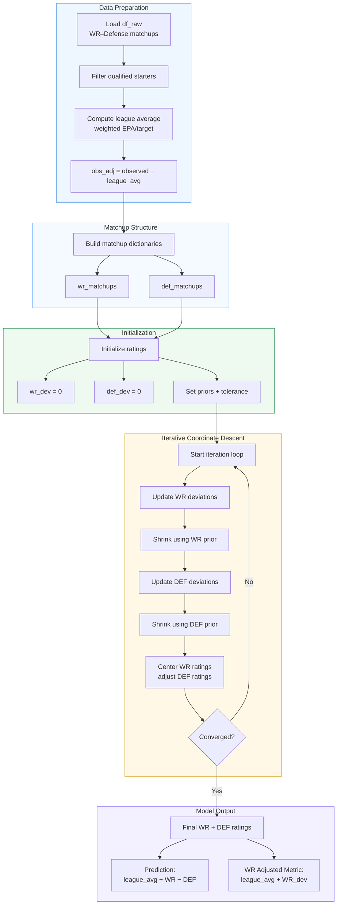

# Adjusted Efficiency Metric (for wrs for example)

This module estimates a schedule-strength-adjusted efficiency metric for NFL wide receivers using a closed, opponent-linked rating system, the model solves for WR performance relative to the defensive units they actually faced, producing a mutually consistent set of offensive and defensive ratings. A WR who posts elite production against top-tier defenses (high negative `def_dev`) deserves a larger upward adjustment than one who posts similar raw numbers against weak secondaries. This metric serves as the **foundation** for all subsequent steps.

### The primary output is:
  > observed = league_avg + WR_dev − DEF_dev + noise

This approach:
- Mirrors **Adjusted Plus-Minus (RAPM)** and **Elo-style rating systems** adapted to continuous efficiency outcomes.
- Creates a **closed system** of starters (no arbitrary replacement level).
- Avoids bias from easy/hard schedules.
- Produces stable, mutually-consistent ratings via iterative coordinate descent (alternating least squares).
- Naturally shrinks low-sample WRs toward the mean (Bayesian-style regularization via priors).

## Input Data Requirements

### `df_raw` expected columns

| Column                | Type    | Description                                      | Required |
|-----------------------|---------|--------------------------------------------------|----------|
| `wr_id`               | str/int | Unique WR identifier (player_id or name+season)  | Yes      |
| `def_id`              | str     | Defensive unit (e.g., "KC_2024", "team_year")    | Yes      |
| `observed`            | float   | EPA per target **or** Yards per Route Run        | Yes      |
| `weight`              | int     | Number of targets (or routes) in the matchup     | Yes      |
| `season` (optional)   | int     | Year for multi-year runs                         | Recommended |
| `game_id` (optional)  | str     | For per-game granularity                         | Optional |

Minimum volume filter applied: ≥50 targets or ≥250 routes per WR (configurable).

## Output DataFrame

Final output per WR (one row per qualified WR):

| Column                     | Type  | Description                                                                 |
|----------------------------|-------|-----------------------------------------------------------------------------|
| `wr_id`                    | str   | WR identifier                                                               |
| `adjusted_epa_per_target`  | float | **Primary metric** = league_avg + wr_dev                                    |
| `wr_dev`                   | float | Solved deviation from average (positive = above expected given opponents)   |
| `raw_epa_per_target`       | float | Unadjusted observed value                                                   |
| `targets`                  | int   | Total targets (sample size)                                                 |
| `league_avg`               | float | League-wide weighted average (stored for reference)                         |
| `percentile`               | float | Percentile rank among qualified WRs (0–100)                                 |
| `num_matchups`             | int   | Number of defensive units faced                                             |

