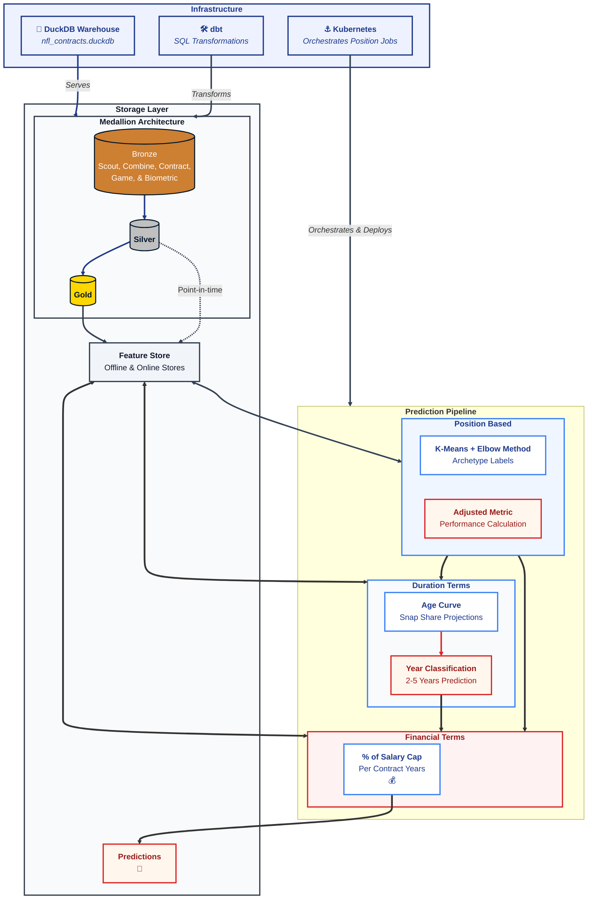

# Arch

```mermaid
graph TB
    %% === THEME & SHAPES ===
    classDef infrastructure fill:#eef2ff,stroke:#1e3a8a,stroke-width:2.5px,color:#1e3a8a
    classDef storage fill:#f9fafb,stroke:#374151,stroke-width:2.5px,color:#111827
    classDef stage1 fill:#eff6ff,stroke:#3b82f6,stroke-width:2.5px,color:#1e3a8a
    classDef stage2 fill:#f8fafc,stroke:#3b82f6,stroke-width:2.5px,color:#1e3a8a
    classDef stage3 fill:#fef2f2,stroke:#dc2626,stroke-width:2.5px,color:#991b1b
    classDef features fill:#f1f5f9,stroke:#334155,stroke-width:2.5px,color:#0f172a
    classDef model fill:#ffffff,stroke:#3b82f6,stroke-width:2.5px,color:#1e3a8a
    classDef output fill:#fff7ed,stroke:#dc2626,stroke-width:2.5px,color:#991b1b
    classDef bold font-weight:bold
    classDef cylinder shape:cylinder
    classDef bronze_node fill:#cd7f32,stroke:#00162b,stroke-width:2px,color:#ffffff,shape:cylinder
    classDef silver_node fill:#c0c0c0,stroke:#00162b,stroke-width:2px,color:#00162b,shape:cylinder
    classDef gold_node fill:#ffd700,stroke:#00162b,stroke-width:2px,color:#00162b,shape:cylinder


    %% === INFRASTRUCTURE ===
    subgraph INFRA ["<b>Infrastructure</b>"]
        DUCKDB["<b>🦆 DuckDB Warehouse</b><br/><i>nfl_contracts.duckdb</i>"]
        K8S["<b>⚓ Kubernetes</b><br/><i>Orchestrates Position Jobs</i>"]
        DBT["<b>🛠️ dbt</b><br/><i>SQL Transformations</i>"]
    end

    %% === PIPELINE ===
    subgraph DATA_FLOW ["<b>Prediction Pipeline</b>"]
        subgraph STAGE_1 ["<b>Position Based</b>"]
            CLUSTERING["<b>K-Means + Elbow Method</b><br/>Archetype Labels"]
            adjusted_metric["<b>Adjusted Metric</b><br/>Performance Calculation"]
        end
        subgraph STAGE_2 ["<b>Duration Terms</b>"]
            YEAR_MODELS["<b>Age Curve</b><br/>Snap Share Projections"]
            YEAR_PREDS["<b>Year Classification</b><br/>2-5 Years Prediction"]
        end
        subgraph STAGE_3 ["<b>Financial Terms</b>"]
            FINANCIAL_MODELS["<b>% of Salary Cap</b><br/>Per Contract Years<br/>💰"]
        end
    end

    %% === STORAGE ===
    subgraph STORAGE ["<b>Storage Layer</b>"]
        subgraph MEDALLION ["<b>Medallion Architecture</b>"]
            direction LR
            scout[("Bronze<br/>Scout, Combine, Contract,<br/> Game, & Biometric")]
            sil[("<b>Silver</b>")]
            gold[("<b>Gold</b>")]
            scout ==> sil ==> gold
        end
        FS["<b>Feature Store</b><br/>Offline & Online Stores"]
        RESULTS["<b>Predictions</b><br/>🏈 "]
    end

    %% === CONNECTIONS ===
     DUCKDB ==>|"<i>Serves</i>"| MEDALLION
    DBT ==>|"<i>Transforms</i>"| MEDALLION
    K8S ==>|"<i>Orchestrates & Deploys</i>"| DATA_FLOW
    
    gold ==> FS
    sil -.->|Point-in-time| FS
    
    FS <==> STAGE_1
    FS <==> STAGE_2
    FS <==> STAGE_3

    STAGE_1 ==> STAGE_2
    YEAR_MODELS ==> YEAR_PREDS
    YEAR_PREDS ==> STAGE_3
    STAGE_1 ==> STAGE_3
    FINANCIAL_MODELS ==> RESULTS

    %% === APPLY STYLES ===
    class INFRA,DUCKDB,K8S,DBT infrastructure
    class STORAGE,MEDALLION,RESULTS storage
    class STAGE_1 stage1
    class STAGE_2 stage2
    class STAGE_3 stage3
    class FS features
    class scout bronze_node
    class sil silver_node

    class gold gold_node
    class CLUSTERING,YEAR_MODELS,FINANCIAL_MODELS model
    class adjusted_metric,YEAR_PREDS,RESULTS output
    class STAGE_1,STAGE_2,STAGE_3 bold

    %% === LINK STYLES ===
    linkStyle 0,1,2 stroke:#1e3a8a,stroke-width:3px
    linkStyle 3,4 stroke:#334155,stroke-width:3px
    linkStyle 5,6,7 stroke:#334155,stroke-width:3px
    linkStyle 11 stroke:#dc2626,stroke-width:3px
```
