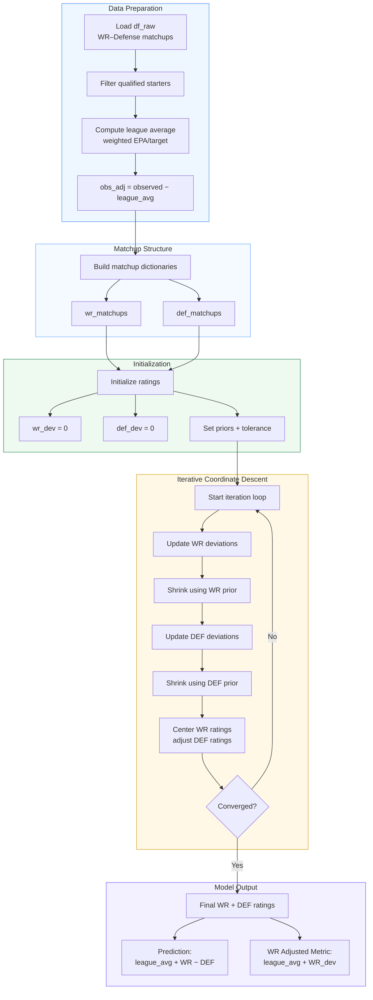

```mermaid


flowchart TD

%% ======================
%% DATA PREP
%% ======================

subgraph DATA["Data Preparation"]
A[Load df_raw<br/>WR–Defense matchups]
B[Filter qualified starters]
C[Compute league average<br/>weighted EPA/target]
D[obs_adj = observed − league_avg]
A --> B --> C --> D
end

%% ======================
%% MATCHUP STRUCTURE
%% ======================

subgraph STRUCTURE["Matchup Structure"]
E[Build matchup dictionaries]
F[wr_matchups]
G[def_matchups]
E --> F
E --> G
end

%% ======================
%% INITIALIZATION
%% ======================

subgraph INIT["Initialization"]
H[Initialize ratings]
I[wr_dev = 0]
J[def_dev = 0]
K[Set priors + tolerance]
H --> I
H --> J
H --> K
end

%% ======================
%% ITERATIVE SOLVER
%% ======================

subgraph SOLVER["Iterative Coordinate Descent"]
L[Start iteration loop]
M[Update WR deviations]
N[Shrink using WR prior]
O[Update DEF deviations]
P[Shrink using DEF prior]
Q[Center WR ratings<br/>adjust DEF ratings]
R{Converged?}

L --> M --> N --> O --> P --> Q --> R
R -- No --> L
end

%% ======================
%% OUTPUT
%% ======================

subgraph OUTPUT["Model Output"]
S[Final WR + DEF ratings]
T[Prediction:<br/>league_avg + WR − DEF]
U[WR Adjusted Metric:<br/>league_avg + WR_dev]
S --> T
S --> U
end

%% FLOW CONNECTIONS
D --> E
F --> H
G --> H
K --> L
R -- Yes --> S

%% Styling
style DATA fill:#eef7ff,stroke:#4a90e2
style STRUCTURE fill:#f4faff,stroke:#6aa9ff
style INIT fill:#eefaf0,stroke:#2e8b57
style SOLVER fill:#fff8e6,stroke:#d4a017
style OUTPUT fill:#f3f0ff,stroke:#7a5cff


```
