# 📊 Snap Share Aging Predictor
This dedicated snap share prediction module analyzes position-specific aging curves to forecast playing time evolution over a player's career. Unlike simple age-based models, it distinguishes between chronological age and NFL accrued seasons, capturing how QB experience compounds value while RB wear accumulates risk. The model outputs year-by-year snap percentage projections that inform contract structuring, roster planning, and draft strategy—transforming "how old is this player?" into "future snap share"

## End Goal

| Year | Age | NFL Seasons | Snap % | Status |
|------|-----|-------------|--------|--------|
| 1 | 25 | 4 | 80% | Peak Production |
| 2 | 26 | 5 | 80% | Prime Window |
| 3 | 27 | 6 | 80% | Final Prime Year |
| 4 | 28 | 7 | 65% | Decline Phase |
| 5 | 29 | 8 | 50% | Replacement Candidate |

## 🏗️ Architecture Diagram

```mermaid
graph TB
    %% === STYLING ===
    classDef input fill:#e0f7fa,stroke:#00bcd4,stroke-width:2px
    classDef feature fill:#fef3c7,stroke:#eab308,stroke-width:2px
    classDef model fill:#f0fff4,stroke:#48bb78,stroke-width:2px
    classDef output fill:#f5f3ff,stroke:#8b5cf6,stroke-width:2px

    %% === 1. INPUT DATA ===
    subgraph INPUTS ["📥 Player Info"]
        AGE["Chronological Age<br/>Calendar age"]
        YEARS["NFL Seasons<br/>Years in league"]
        POSITION["Position<br/>QB or RB"]
        PAST_SNAPS["Past Snap %<br/>Last 3 years"]
    end

    %% === 2. POSITION MODELS ===
    subgraph MODELS ["🎯 Position-Specific Rules"]
        
        subgraph QB_RULES ["🎯 QB Rules"]
            QB_AGE["Age Curve:<br/>Peak 28-35, decline after"]
            QB_EXP["Experience Bonus:<br/>More years = more snaps"]
            QB_OUT["QB Snap %"]
        end
        
        subgraph RB_RULES ["🎯 RB Rules"]
            RB_AGE["Age Curve:<br/>Peak 24-27, sharp decline"]
            RB_WEAR["Wear-and-Tear:<br/>Each year = -5% snap risk"]
            RB_OUT["RB Snap %"]
        end
    end

    %% === 3. DRAFT IMPACT ===
    subgraph DRAFT ["📋 Rookie Competition"]
        ROOKIE_QB["QB Rookies:<br/>Rarely play Year 1"]
        ROOKIE_RB["RB Rookies:<br/>Often play immediately"]
        REPLACE_RISK["Replacement Risk:<br/>High for old RBs"]
    end

    %% === 4. PREDICT SNAPS ===
    subgraph PREDICTOR ["📈 Snap Predictor"]
        BASE["Base Snap %<br/>From Age + Experience"]
        DRAFT_ADJUST["Rookie Adjustment<br/>-5% to +5%"]
        FINAL_SNAP["Final Snap %<br/>Year-by-Year"]
    end

    %% === 5. OUTPUT ===
    subgraph OUTPUT ["📊 Yearly Projections"]
        direction TB
        YEAR1["Year 1:<br/>Age __, __% snaps"]
        YEAR2["Year 2:<br/>Age __, __% snaps"]
        YEAR3["Year 3:<br/>Age __, __% snaps"]
      
        
        YEAR1 --> YEAR2 --> YEAR3 
    end

    %% === DATA FLOW ===
    %% Inputs → Models
    AGE --> QB_AGE
    AGE --> RB_AGE
    YEARS --> QB_EXP
    YEARS --> RB_WEAR
    POSITION --> QB_RULES
    POSITION --> RB_RULES
    PAST_SNAPS --> BASE
    
    %% Models → Draft Impact
    QB_AGE --> ROOKIE_QB
    RB_AGE --> ROOKIE_RB
    RB_AGE --> REPLACE_RISK
    
    %% Everything → Predictor
    QB_OUT --> BASE
    RB_OUT --> BASE
    ROOKIE_QB --> DRAFT_ADJUST
    ROOKIE_RB --> DRAFT_ADJUST
    REPLACE_RISK --> DRAFT_ADJUST
    
    %% Predictor → Output
    BASE --> FINAL_SNAP
    DRAFT_ADJUST --> FINAL_SNAP
    FINAL_SNAP --> YEAR1

    %% Styles
    class INPUTS input
    class MODELS model
    class DRAFT feature
    class PREDICTOR model
    class OUTPUT output
```

